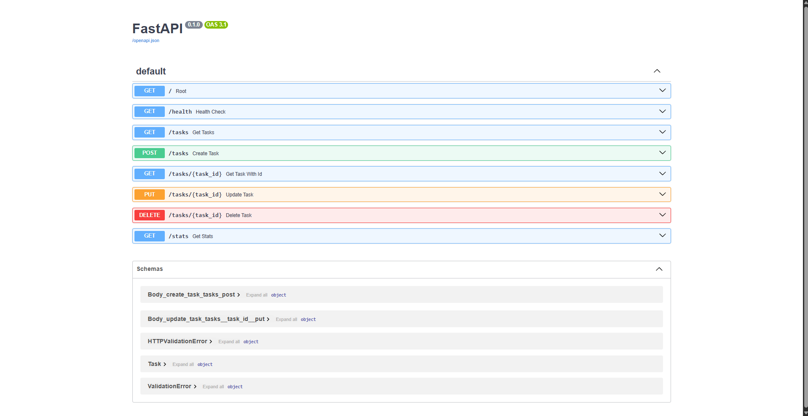

# Task Management API

A lightweight RESTful backend service built with FastAPI and Pydantic for managing simple task lists and monitoring completion status.

---

## Overview

This project provides a clean, fast API service to perform basic CRUD operations on tasks. It includes built-in endpoints for checking health status, retrieving task statistics, creating, updating, and deleting tasks.

---

## Installation & Running

### Prerequisites
- Python 3.8+
- pip package manager

### 1. Install Dependencies
```bash
pip install fastapi uvicorn

```

### 2. Run the Server

Run the application locally using uvicorn:

```bash
uvicorn main:app --reload

```

> Note: Access the server at http://127.0.0.1:8000 once running.

---

## API Endpoints Summary

| Method | Endpoint | Description | Request Body | Response Code |
| :--- | :--- | :--- | :--- | :--- |
| **GET** | `/` | API Metadata & available endpoint list | None | `200 OK` |
| **GET** | `/health` | Server health check | None | `200 OK` |
| **GET** | `/tasks` | List all tasks (supports optional `done=true` or `done=false` filter) | None | `200 OK` |
| **GET** | `/tasks/{task_id}` | Get details of a specific task by ID | None | `200 OK` / `404 Not Found` |
| **GET** | `/stats` | Get task counts summary (`total`, `done`, `open`) | None | `200 OK` |
| **POST** | `/tasks` | Create a new task | `{"title": "string"}` | `201 Created` |
| **PUT** | `/tasks/{task_id}` | Update the title of an existing task | `{"new_title": "string"}` | `200 OK` / `404 Not Found` |
| **DELETE** | `/tasks/{task_id}` | Delete a task by ID | None | `204 No Content` / `404 Not Found` |

---

## Interactive API Documentation (Swagger UI)

FastAPI automatically generates interactive Swagger documentation available at `/docs`.



---

## Sample Request & Response (curl -i)

Here is an example response when creating a new task using curl:

```http
HTTP/1.1 201 Created
date: Mon, 27 Jul 2026 11:24:52 GMT
server: uvicorn
content-length: 22
content-type: application/json

{"message":"Created!"}

```